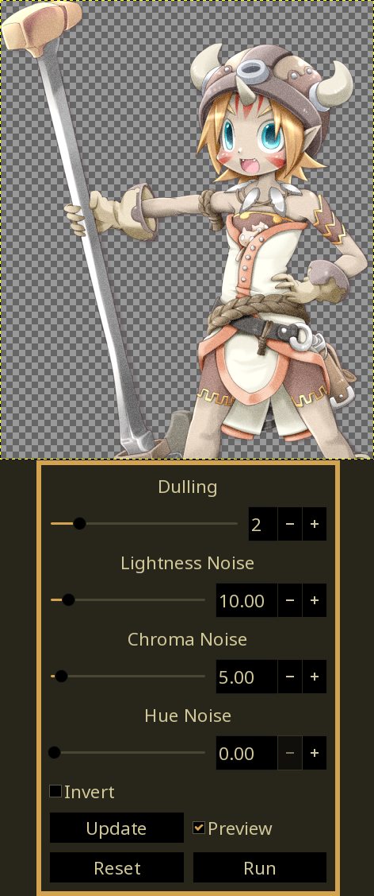

# bsz-gimp-plugins
### Plugins for GIMP 2.99+
Currently at the "I *think* I understand this now" phase.

Needs the bszgw.py file from https://github.com/Beinsezii/BSZGW at the root. Will be bundled with releases.

Also needs NumPy for filmic-chroma and future pixel math plugins. Usually already installed in Linux, will look into bundling with Windows versions if GIMP doesn't already.

Should work with windows. Can't really test since there's no 2.99 builds yet. Everything's either python standard library or PyGobject, and gimp should bundle those as it's necessary for thier own python scripts.

## Current Plugins
todo: get better example images.
### Dual Bloom 2
Produces both a light and dark bloom, based on gimp/gegl's existing bloom. Arguably prettier than the OG Dual Bloom.

<table class="img-compare">
  <tr>
    <th></th>
    <th></th>
  </tr>
  <tr>
    <td>Before</td>
    <td>After</td>
  </tr>
</table>

### Dual Bloom
Produces both a light and a dark bloom based on thresholds, with as many config options as I can squeeze into GEGL. This preceeded Dual Bloom 2, and the results are similar but not exact.

<table class="img-compare">
  <tr>
    <th></th>
    <th></th>
  </tr>
  <tr>
    <td>Before</td>
    <td>After</td>
  </tr>
</table>

### Filmic Chroma
Reduces/increases chroma based on intensity. Inspired by Blender's new 'Filmic' tonemapper.

<table class="img-compare">
  <tr>
    <th>Before</th>
    <th>After</th>
  </tr>
  <tr>
    <td></td>
    <td></td>
  </tr>
  <tr>
    <td></td>
    <td></td>
  </tr>
</table>

### Lightgrain
LCH Noise masked to Lightness

<table class="img-compare">
  <tr>
    <th></th>
    <th></th>
  </tr>
  <tr>
    <td>Before</td>
    <td>After</td>
  </tr>
</table>

### Pixel Math
Enter custom algorithms for pixel math. Pixels stored in NumPy array 'pixels'.

## Installation
Either
 - Download the release and unpack it into your already existing plugins folder
 - Or, for cleanliness, unpack the release to its own folder and add that folder as a plug-in directory in Gimp's folder settings.

## bsz_gimp_lib
Shared library for plugins. Notably contains a *complete plugin auto-builder*. Similar to the old python-fu, but (imo) significantly more customizable at a mild complexity cost. Features include
 - Actual live previews using a preview layer and *doesn't pollute undo history*.
 - UI that isn't just a bunch of widgets smashed into a column (but it can be if that's what you want)
   - Chains
   - Logarithmic scales courtesy of BSZGW
 - Extensible using the Param abstract class. Plugins can make their own widgets/parameters.
   - Currently only bundles numeric scales and comobo boxes. More bundled Params to be added.
 - Somewhat documented mostly in nice words.
Check out bsz-dualbloom2.py for a decent example. This obviously can't cover every plugin use scenario, but I'd say covering 95% of use cases is good enough. 

Other non-plugin-builder bits include:
 - Premade dictionary of Gegl compositors
   - Ripped from the gegl site's html.
   - Only includes operations that use pads input, aux, output.
 - PDB quick function. WIP.
