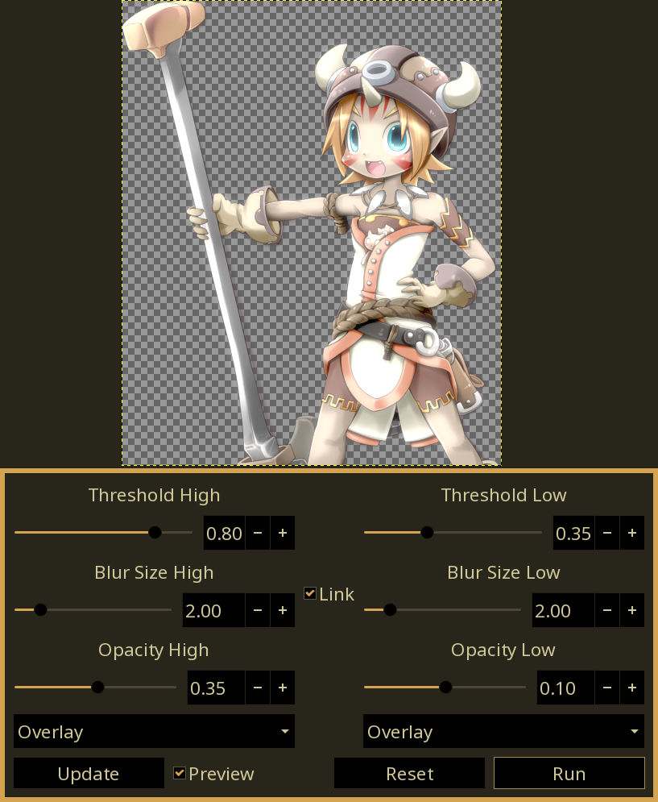

# bsz-gimp-plugins
### Plugins for GIMP 2.99+
Currently at the "I *think* I understand this now" phase.

Needs the bszgw.py file from https://github.com/Beinsezii/BSZGW at the root. Will be bundled with release tags.

## Current Plugins
### Dual Bloom
Produces both a light and a dark bloom based on thresholds, with as many config options as I can squeeze into GEGL. Best explanation is to try it.

## Installation
Download the folder somewhere and add it as a 'plug-in' directory in your gimp preferences.
