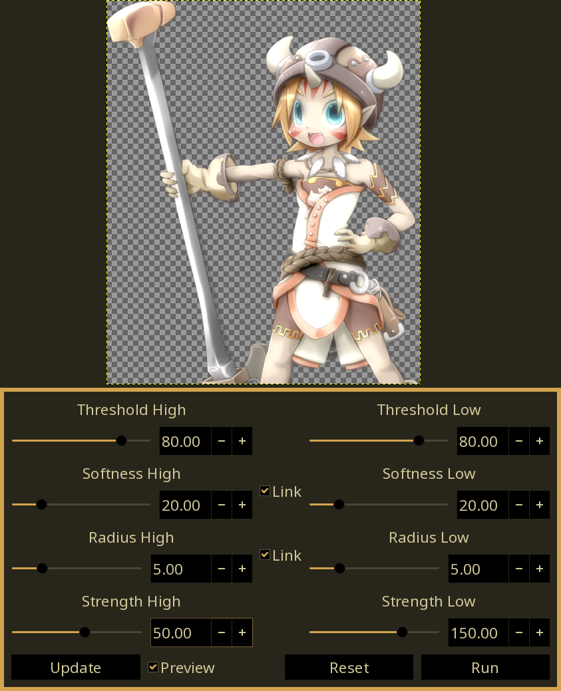

# bsz-gimp-plugins
### Plugins for GIMP 2.99+
Currently at the "I *think* I understand this now" phase.

Needs the bszgw.py file from https://github.com/Beinsezii/BSZGW at the root. Will be bundled with release tags.

## Current Plugins
### Dual Bloom 2
Produces both a light and dark bloom, based on gimp/gegl's existing bloom.

<table class="img-compare">
  <tr>
    <th></th>
    <th></th>
  </tr>
  <tr>
    <td>Before</td>
    <td>After</td>
  </tr>
</table>

### Dual Bloom
Produces both a light and a dark bloom based on thresholds, with as many config options as I can squeeze into GEGL. This preceeded Dual Bloom 2, and the results are similar but not exact.

<table class="img-compare">
  <tr>
    <th></th>
    <th></th>
  </tr>
  <tr>
    <td>Before</td>
    <td>After</td>
  </tr>
</table>

## Installation
Download the folder somewhere and add it as a 'plug-in' directory in your gimp preferences, or unpack the .tar into your existing plugins folder.
